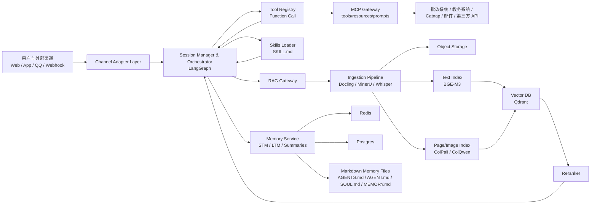
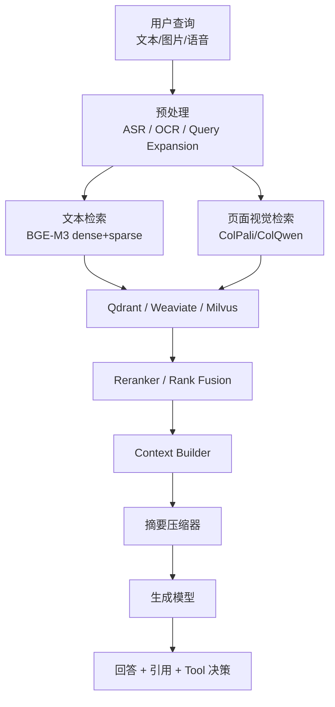
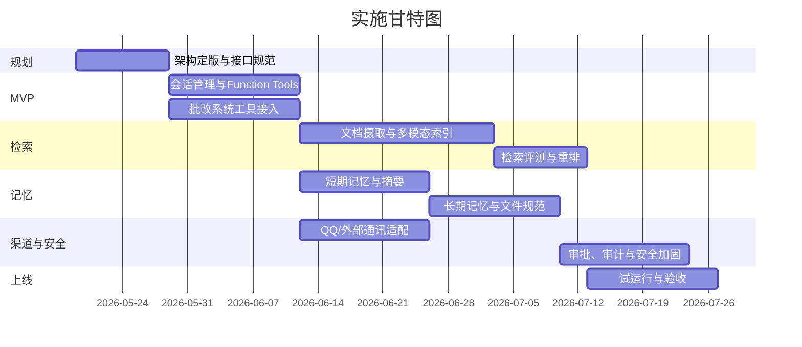

# 支持 MCP、Function Call、Skills 与多模态 RAG 的智能体系统 PRD

## 执行摘要

本 PRD 的核心结论是：不要试图用单一框架“一把梭”覆盖 MCP、function call、skills、多模态 RAG、会话摘要、短期/长期记忆与外部通讯接入。更可落地的做法，是采用**分层架构**：以**LangGraph**或等价的持久化编排层负责状态机与会话恢复，以**OpenAI Responses API / Agents SDK 风格的函数调用层**负责严格 JSON Schema 工具调用，以**MCP**负责跨系统标准化接入工具、资源与提示模板，以**Agent Skills**负责“领域操作说明书”的渐进式装载，以**Qdrant / Weaviate / Milvus** 等向量检索层承载多模态 RAG，以**Redis + Postgres + 向量库 + Markdown 记忆文件**承载短期与长期记忆。这样做的原因是：MCP 解决“怎么接”，function calling 解决“怎么调”，skills 解决“知道何时、按什么流程调”，RAG/记忆解决“调什么知识”，而上下文压缩解决“在有限上下文里如何持续工作”。citeturn34search18turn12search15turn35search2turn16search0turn16search2

在技术选型上，若以“中小工程团队、无特定平台限制、优先可复现与集成”为前提，默认推荐组合是：**Python 核心服务 + LangGraph 编排 + OpenAI/兼容式 Tool Registry + MCP Gateway + Agent Skills + Docling/MinerU 文档解析 + Qdrant 向量库 + BGE-M3 中文文本嵌入 + ColPali/ColQwen 类页面视觉检索 + BGE Reranker + Redis/Postgres/Object Storage**。这一组合的优势在于：LangGraph 原生强调 durable execution、persistence 与 thread-scoped memory；OpenAI function calling 能用 `strict: true` 获得强约束 schema；MCP 已形成 tools/resources/prompts 的协议面；Agent Skills 已形成开放规范与 progressive disclosure；Qdrant 对 named vectors、hybrid query、multi-stage query 与 multivector 的支持非常适合把“文本 + 图像 + 页面级视觉向量”放到一个统一检索平面里。citeturn16search0turn16search2turn28search2turn34search5turn34search7turn34search3turn35search1turn25search1turn4search1turn25search4turn25search7

在多模态 RAG 上，建议**双索引或三索引而非单索引**：文本索引负责段落、标题、代码、结构化字段；页面图像索引负责图表、截图、公式、复杂排版；可选的对象级索引用于图片区域、表格或视频关键帧。LlamaIndex 官方多模态方案本身就是文本与图像分开建索引；ColPali/ColQwen 这类 late-interaction 文档视觉检索模型则说明，对于图表、表格、页面布局信息，直接对页面图像建模比“先 OCR 再纯文本检索”更稳健。对于中文场景，BGE-M3 兼具多语言、dense/sparse/multi-vector 能力，适合做主文本检索器；如需要统一 text-image API，可引入 Voyage 或 Cohere 的多模态 embedding；如你的团队更重视极低运维，Pinecone 也可作为托管替代。citeturn3search14turn3search7turn5search3turn6search0turn26search9turn6search2turn6search14turn23search10

在记忆与上下文管理上，推荐把系统分成四层：**会话工作记忆**、**可滚动摘要记忆**、**长期 episodic memory**、**身份/行为记忆**。其中身份/行为记忆建议用文件制品表达：`AGENTS.md` 负责项目与代理工作约束，`AGENT.md`/`agent.md` 仅做兼容层，`SOUL.md` 负责人格、风格与价值边界，`MEMORY.md` 负责经人工确认或自动提炼后的稳定事实。业界现状并不统一：`AGENTS.md` 与 `AGENT.md` 是两个并存生态，`SOUL.md` 更偏社区实践而非正式标准，因此工程上应当采用**单一权威源 + 自动生成兼容副本**，而不是手工维护多个版本。citeturn8search2turn8search16turn33search1turn33search0turn31search3turn9search11

从实施路径看，最稳妥的是三阶段：先做**工具与会话内存通路打通的 MVP**；再做**多模态知识接入与检索评估闭环**；最后补**长期记忆、上下文压缩、权限审批、外部通讯适配**。对接现有批改系统时，应将“作业、题目、rubric、历史批注、回写成绩、学生通知”做成 MCP resources/tools 或 function tools；对接 QQ 等通讯渠道时，应采用统一的 Channel Adapter SPI，把官方 QQ Bot、OneBot、NapCat 等接入方式都映射到统一事件模型。官方 QQ Bot 文档可满足合规接入；若需要 OneBot 生态的灵活度和群场景能力，可用 NapCat/OneBot；而 go-cqhttp 更适合作为遗留兼容路径，不应作为新系统主线。citeturn30search7turn30search11turn30search1turn30search16turn30search14

## 目录

- 背景与产品目标  
- 总体架构与推荐技术栈  
- 模块设计与接口规范  
- 多模态 RAG、记忆与上下文管理  
- 迁移适配与实施计划  
- 可复用开源仓库与结论  

## 背景与产品目标

这个系统的本质，不是“做一个会聊天的机器人”，而是做一个**可长期运行、可接外部系统、能稳定调用工具、能对复杂文档和多模态知识做检索、还能跨会话保持行为一致性**的代理平台。MCP 已经把 agent 对外部系统的接入面抽象成 **tools / resources / prompts** 三类原语；OpenAI 的 function calling 则把“让模型决定调用哪个函数、传什么参数”做成了严格 JSON Schema 能力；Agent Skills 又把“领域知识、步骤、脚本、参考资料”的组织方式抽象成渐进加载的开放格式。把三者组合起来，才是 2026 年更成熟的代理系统形态。citeturn34search18turn34search5turn34search7turn34search3turn28search2turn35search2

从产品边界上看，MCP、function call、skills 不是可相互替代的概念，而是不同层级的能力。下面这张表建议作为系统设计时的“语义边界”：

| 概念 | 主要解决的问题 | 在本系统中的角色 |
|---|---|---|
| MCP | 如何把外部系统标准化暴露给 agent | 对外部业务系统、检索服务、通讯服务的统一协议面 |
| Function call | 模型如何按 schema 可靠调用动作 | 工具执行路由层，承载审批、重试、幂等与审计 |
| Skills | Agent 在什么场景该采用什么步骤/知识/脚本 | 领域操作手册与 SOP 的渐进式装载层 |
| RAG | 如何把知识按需取回到当前上下文 | 文本、图像、页面、音频转录的检索层 |
| 短期记忆 | 当前会话如何保持工作状态 | thread state、缓存摘要、未完成任务 |
| 长期记忆 | 系统如何跨会话保留稳定认知 | 用户、项目、流程、偏好、历史决策 |
| 上下文压缩 | 长对话如何不爆上下文且不丢关键决策 | 滚动摘要、文档压缩、重排、片段淘汰 |

这个 PRD 的目标不是绑定某个模型供应商，而是产出一个**协议先行、模型可插拔、检索与记忆分层、渠道可扩展**的系统。若你后续换 OpenAI、Azure、Anthropic、本地 vLLM/兼容接口，或从 QQ 扩展到邮件、企业 IM、Webhook 机器人，架构不应该大改。Semantic Kernel、AutoGen、OpenAI Agents SDK、LangGraph 都在朝“多 agent、工具、状态、遥测、审批”的统一方向发展，但它们各自强项不同，因此推荐采用“编排层 + 能力层 + 适配层”的组合，而不是单框架锁死。citeturn38search6turn15search6turn16search0turn29search3

## 总体架构与推荐技术栈

从工程落地角度，建议采用“**编排内核、能力中台、知识与记忆底座、渠道适配层**”四层结构。默认主选是 **LangGraph 作为编排内核**，因为它对 durable execution、checkpoint、短期/长期 memory 与 human-in-the-loop 的支持更直接；**OpenAI Agents SDK** 更适合作为 function-tool / guardrails / tracing 参考实现，尤其当你走 OpenAI-first 路线时；**LlamaIndex** 更适合作为文档摄取、多模态索引与检索评估子系统；**Semantic Kernel / AutoGen** 适合企业插件化或多 agent 协作场景；**PydanticAI** 则适合你希望把 tool schema、typed deps、eval pipeline 做得更强约束时使用。citeturn16search0turn16search2turn15search6turn15search3turn28search3turn3search14turn3search2turn38search7turn38search9turn29search3turn14search5turn17search5turn18search2

默认推荐技术栈如下：

| 层 | 默认推荐 | 可替代方案 | 选择理由 |
|---|---|---|---|
| 编排层 | LangGraph + LangChain | OpenAI Agents SDK、AutoGen、Semantic Kernel | 持久化、线程状态、人工审批、长任务恢复更成熟 |
| Tool 调用层 | OpenAI 风格 Tool Registry + `strict: true` | Semantic Kernel Plugins、PydanticAI tools | JSON Schema 约束清晰，便于权限/审计/回放 |
| MCP 层 | 官方 MCP spec + 内部 MCP gateway | 直接 REST/SDK 接口 | 降低工具与业务系统耦合，兼容 remote MCP |
| Skills 层 | Agent Skills (`SKILL.md`) | 自定义 SOP 文件、PydanticAI capabilities | progressive disclosure 节省 token；利于团队共享 |
| 文档摄取 | Docling + MinerU | LlamaParse、Unstructured | 复杂 PDF / 表格 / 图像解析能力更强 |
| 文本检索 | Qdrant + BGE-M3 + reranker | Weaviate / Milvus / Pinecone | 中文、多语言、hybrid、多向量能力平衡较好 |
| 页面视觉检索 | ColPali / ColQwen 类 multivector | Voyage/Cohere multimodal embedding | 图表、截图、排版信息召回更稳 |
| 短期记忆 | Redis + LangGraph checkpointer | 内存 checkpointer、SQLite | 低延迟、适合 thread state 与 session cache |
| 长期记忆 | Postgres + Qdrant + Markdown files | Letta、MemGPT 风格框架 | 结构化元数据 + 向量检索 + 人工可读文件并存 |
| 外部通讯 | Channel Adapter SPI | 直连单一机器人 SDK | 为 QQ / Catnap / 邮件 / Webhook 统一抽象 |

下面的 Mermaid 图给出建议的参考架构：



这套架构遵循三个成熟做法。第一，**工具与执行环境分离**：OpenAI 在 Sandbox Agents 示例里明确把 harness 留在可信宿主进程，把 shell/file edits 放在隔离环境中，这一点非常值得照抄到本系统的高风险工具执行路径里。第二，**MCP 作为接入标准而不是业务逻辑所在**：MCP 负责暴露能力，不负责承载复杂编排。第三，**skills 与 tools 分工**：skills 负责知识和步骤，tools 负责动作和副作用。citeturn10search10turn12search5turn35search7

部署建议上，PoC 阶段用 `docker compose` 即可：`agent-core`、`qdrant`、`redis`、`postgres`、`minio`、`parser-worker`、`reranker-worker`、`channel-adapter`。生产阶段建议至少拆成五个独立服务：编排服务、检索服务、文档摄取服务、记忆服务、渠道适配服务，并统一接入 tracing、metrics 与 audit log。若团队明确不想自运维向量库，Pinecone 的 serverless + namespaces + integrated inference 会明显降低运维成本，但代价是更强的供应商绑定与按量计费。官方资料显示 Pinecone 已在 2025–2026 年持续强化 integrated embedding/reranking、multitenancy 与本地开发模拟器能力，Builder 套餐在 2026 年引入了 $20/月平价档，但线上生产依然是用量驱动。citeturn23search0turn23search1turn23search18turn23search13turn23search4

## 模块设计与接口规范

先给出 Agent/Tool/Skills 框架比较，因为这会直接决定你的主编排框架与二级子系统如何拆分：

| 框架 | 调用模式 | MCP / Skills 能力 | 优势 | 局限 | 推荐角色 |
|---|---|---|---|---|---|
| LangGraph / LangChain citeturn16search0turn16search2turn29search1turn16search4 | 图状态机、节点/边、checkpointer | 有 MCP adapters；无原生 skills 标准但可自行接入 | 持久化、恢复、人工审批、上下文压缩组件多 | 需要自行装配更多能力 | **主编排首选** |
| LlamaIndex citeturn3search3turn3search14turn29search2 | workflow / agent / retriever 组合 | 有 MCP 指南；偏文档与检索 | 多模态索引、文档摄取、检索评估强 | 通用业务编排不如 LangGraph 透明 | **RAG 子系统首选** |
| OpenAI Agents SDK citeturn14search0turn15search6turn15search3turn28search3turn28search5 | agent、handoff、guardrail、tool | 支持 hosted tools / function tools / MCP；无官方 skills 标准 | OpenAI-first 最省力，guardrails/tracing 清晰 | 多供应商与长期状态治理要靠外围系统补 | **OpenAI-first 方案** |
| Semantic Kernel citeturn38search7turn38search1turn38search9 | plugin + function choice behavior | 插件能力强，可从 MCP server 加 plugin | 企业插件化、类型安全、.NET/Java 友好 | Python 生态下多模态 RAG 组合不如前两者丰富 | **企业集成/插件层** |
| AutoGen citeturn29search3turn29search7turn14search5 | agentchat / workbench / team | 有 `McpWorkbench`；memory/RAG 模式明确 | 多 agent 协作自然，MCP 集成直接 | 生产级状态治理仍需外围设计 | **多 agent 协作备选** |
| PydanticAI citeturn14search2turn14search6turn17search5turn18search2 | typed tools / capabilities | 有 capabilities，第三方已接 skills 生态 | 工具 schema、类型、eval 友好 | 生态规模仍小于 LangChain/LlamaIndex | **强类型工具层** |

再给出本系统的模块设计总表。这里的“成本/性能”均为**工程粗估等级**，不是官方报价。

| 模块 | 目标 | 推荐选型与可落地实现 | 优点 | 局限 | 集成难度 | 粗略成本/性能 | 安全与隐私 / 测试方法 |
|---|---|---|---|---|---|---|---|
| MCP 网关 | 统一暴露业务工具、资源、提示模板 | 官方 MCP spec，优先 Streamable HTTP；内部业务通过 MCP server 包装；外部 agent 通过 remote MCP 接入 citeturn12search6turn12search9turn12search2turn34search18 | 跨框架复用、替换成本低 | OAuth、会话生命周期和权限设计复杂 | 中 | 低~中；I/O 为主 | 用 OAuth/OIDC、scope、server allowlist；测试 capability negotiation / auth fail / timeout / idempotency citeturn34search21turn12search7 |
| Function Call Registry | 让模型可靠调用内部动作 | JSON Schema 工具定义；OpenAI 风格 `strict: true`；risk/approval 元数据扩展 citeturn28search2turn28search13turn15search0 | 工具协议清晰，回放与审计容易 | 不同模型对 function calling 兼容性参差 | 低~中 | 低；主要是 schema 管理 | 所有写操作必须幂等键+审批；单元测试 schema conformance、mock tool replay |
| Skills Loader | 以低 token 成本加载领域 SOP | Agent Skills `SKILL.md` 规范；必要时兼容 PydanticAI capabilities 或企业自定义 skill provider citeturn35search1turn35search3turn35search5turn18search2 | progressive disclosure，知识与脚本可封装和共享 | 需要维护 skill catalog 与描述质量 | 中 | 低；上下文成本可控 | skill 描述做触发测试；回归测试“是否触发、是否过触发、是否漏触发” |
| 多模态摄取 | 把 PDF、图片、音频、Office 文档变成索引输入 | Docling + MinerU；音频可加 Whisper；必要时补对象存储与异步队列 citeturn7search0turn7search16turn7search17turn22search3turn7search3turn7search15 | 复杂文档解析强，适合科研/教育资料 | OCR/VLM 成本高，摄取链较长 | 中~高 | 中；摄取通常离线/异步 | 需做 PII 脱敏、文件类型白名单；测试解析准确率、表格/图表回收率 |
| 向量检索 | 统一承载 dense/sparse/multivector 检索 | 默认 Qdrant；大规模可换 Milvus；功能派可选 Weaviate；托管云可选 Pinecone citeturn25search1turn4search1turn25search4turn23search14turn24search1turn23search0 | 可按业务取舍运维和性能 | 库选型影响大，迁移成本不小 | 中 | 中；与数据规模强相关 | 测 recall@k / p95 latency / filter correctness / tenant isolation |
| 多模态索引 | 覆盖图表、截图、复杂布局 | 文本索引 + 页面图像索引双轨；页面视觉用 ColPali/ColQwen 系，或统一 multimodal embedding API citeturn5search3turn25search7turn25search12turn6search2turn6search14 | 图文混排资料效果更稳 | pipeline 更复杂，需要 fusion | 中~高 | 中~高；索引体积上升明显 | 测 text-only / visual-only / mixed queries 三类集；做人审 gold set |
| 会话管理 | 管理 thread、审批、工具回放 | LangGraph persistence/checkpointer；高风险路径加入 human-in-the-loop citeturn16search2turn16search17turn16search15 | 恢复、暂停、回放能力强 | 需要设计状态 schema | 中 | 低~中 | 测断点恢复、审批中断、重复提交、并发 thread 冲突 |
| 短期记忆 | 在单会话内保存工作态 | Redis + thread checkpoint + rolling summary | 低延迟、实现简单 | 跨会话价值低 | 低 | 低 | 测状态一致性、TTL、回话恢复正确率 |
| 长期记忆 | 保存人物、项目、事实、偏好 | Postgres 元数据 + Qdrant episodic memory + `AGENTS.md`/`AGENT.md`/`SOUL.md`/`MEMORY.md` 文件层；可借鉴 Letta/MemGPT 分层记忆 citeturn8search0turn8search11turn20search0turn33search1turn33search0turn31search3 | 兼顾机器检索与人工可读 | 容易被污染或过时 | 中 | 中 | 版本化、人工审核写入；测 memory precision、staleness、contradiction |
| 上下文压缩与会话摘要 | 控制 token 与长期质量衰减 | Rolling summary + LLMLingua / contextual compression / rerank + 可选 RECOMP 思路 citeturn10search0turn11search0turn11search1turn16search4turn11search10 | 成本可控，长会话更稳 | 过度压缩会损失可恢复性 | 中 | 低~中；节省推理成本明显 | 测覆盖率、压缩率、事实冲突率、恢复问答成功率 |
| 外部通讯适配层 | 接入 QQ、Catnap、邮件、Webhook 等 | 统一 Channel Adapter SPI；QQ 优先官方 Bot 或 OneBot/NapCat；遗留系统兼容 go-cqhttp citeturn30search7turn30search11turn30search1turn30search16turn30search14 | 渠道扩展快，业务核心不受渠道影响 | 不同渠道能力差异大 | 中 | 低~中；I/O 为主 | 测消息去重、重试、富媒体降级、循环消息、权限校验 |

建议把 function tools 的注册协议做成**统一清单**，而不是散落在代码里。最少应包含名称、说明、JSON Schema、风险级别、审批策略、幂等等字段。例如：

```json
{
  "name": "publish_grade",
  "description": "将评分结果回写到批改系统并向学生发布",
  "strict": true,
  "risk_level": "high",
  "approval_policy": "human_required",
  "idempotency_key_source": "submission_id+rubric_version",
  "parameters": {
    "type": "object",
    "additionalProperties": false,
    "properties": {
      "submission_id": { "type": "string" },
      "score": { "type": "number" },
      "feedback_markdown": { "type": "string" }
    },
    "required": ["submission_id", "score", "feedback_markdown"]
  }
}
```

之所以推荐这样做，是因为 OpenAI 的 Structured Outputs 与 `strict: true` 已经把“参数必须严格匹配 schema”做成了成熟能力；Semantic Kernel 和 PydanticAI 也都强调函数/工具元信息对模型选择行为的重要性。citeturn28search0turn28search2turn38search1turn14search6

skills 建议采用如下目录约定，并把它们与工具分开治理：

```text
skills/
  grading-review/
    SKILL.md
    references/
      rubric-guidelines.md
      common-mistakes.md
    scripts/
      rubric_diff.py
    tests/
      trigger_cases.yaml
  qq-ops/
    SKILL.md
    references/
      moderation-policy.md
```

Agent Skills 官方规范强调 progressive disclosure，推荐只在启动时装入 `name` 与 `description`，在真正命中任务时才加载 `SKILL.md` 主体，详细参考资料再按需读取。这一点非常适合“批改规范”“教务流程”“QQ 群运营准则”这类高频但不应常驻上下文的内容。citeturn35search1turn35search3turn35search9

外部通讯建议统一成一份标准事件模型，避免业务逻辑被某个机器人平台绑死。参考接口如下：

```json
{
  "channel": "qq",
  "platform_protocol": "onebot_v11",
  "conversation_id": "group:123456",
  "message_id": "evt_abc",
  "sender": {
    "user_id": "u_001",
    "display_name": "张三",
    "role": "student"
  },
  "content": {
    "text": "请总结这份 PDF",
    "attachments": [
      {
        "type": "file",
        "mime": "application/pdf",
        "uri": "oss://bucket/file.pdf"
      }
    ]
  },
  "timestamp": "2026-05-18T10:30:00+09:00"
}
```

## 多模态 RAG、记忆与上下文管理

多模态 RAG 这一块，最容易踩的坑是：**把所有内容都先转成纯文本，再做单一文本向量检索**。这在普通 FAQ 上可行，但对教育场景、科研 PDF、图表密集文档、包含截图/公式/表格的材料，往往会丢掉关键证据。LlamaIndex 的多模态索引方案明确区分文本索引与图像索引；ColPali 论文则直接指出，页面图像级检索能更好捕捉布局与视觉线索。对你这个系统，正确做法是“文本与页面视觉并行摄取、并行检索、统一融合”。citeturn3search14turn3search7turn5search3

在向量数据库与 ANN 检索器上，建议这样比较和选择：

| 方案 | 已验证能力 | 更适合的场景 | 不足与代价 | 推荐结论 |
|---|---|---|---|---|
| Qdrant citeturn25search1turn4search1turn25search4turn25search7turn25search18 | named vectors、hybrid query、多阶段 query、multivector、ColPali/ColQwen 教程齐全 | **默认自建首选**；中等规模知识库；多模态/多向量融合 | 运维仍要自己做；极大规模需更细化容量规划 | **本 PRD 默认推荐** |
| Weaviate citeturn24search1turn25search2turn25search5turn25search23turn4search2 | hybrid、named vectors、multi-vectors、multimodal vectorizer | 想要更强内建特性与查询体验 | 配置面较多；自建运维复杂度中等 | 功能派备选 |
| Milvus citeturn23search14turn26search1turn26search4turn22search0 | 多向量字段、BM25/full-text、hybrid、multimodal RAG 实践 | 大规模、高吞吐、海量向量 | 自建复杂度更高 | 超大规模备选 |
| Pinecone citeturn23search0turn23search1turn23search18turn4search3turn23search4 | namespaces 多租户、integrated embedding/reranking、serverless、本地模拟器 | 低运维、快速上线、托管云优先 | 供应商绑定强，生产成本按量走高 | 云托管备选 |
| FAISS citeturn5search16turn5search0 | dense vector ANN、GPU 支持、本地库成熟 | 本地 PoC、离线 benchmark、单机场景 | 不是完整在线 DB；过滤与租户治理要自己补 | **本地基线必备** |
| Annoy citeturn5search1turn5search13 | mmap、只读静态索引、简单 | 轻量、静态数据集 | 动态更新弱、生态更新慢 | 仅静态轻量场景 |

如果你的核心场景是**中文教育文档 + 图文 PDF + 需要跨会话记忆 + 中小团队自运维**，推荐组合为：

- **文本主索引**：BGE-M3 dense + sparse hybrid  
- **视觉页面索引**：ColPali/ColQwen 类 multivector  
- **向量库**：Qdrant  
- **重排器**：BGE reranker 或云端 reranker  
- **解析器**：Docling / MinerU  
- **音频输入**：Whisper 转写后进入文本索引

推荐理由是：BGE-M3 明确支持 multifunctionality、multilinguality 与 multi-granularity；Qdrant 原生支持 named vectors、hybrid query 与 multivector；ColPali/ColQwen 适合对 PDF 页面图像做 late interaction；Docling/MinerU 对表格、OCR、坐标与多格式文档的支持比传统纯 OCR 管道更适合作为 RAG 前处理。citeturn6search0turn26search9turn25search1turn4search1turn25search4turn25search7turn7search0turn7search16turn22search3

如果你更重视“最少自建模型”，可用 **Voyage multimodal embeddings** 或 **Cohere Embed v4** 走统一多模态 embedding API。它们都支持 text + image，且支持 interleaved input；前者尤其强调“内容丰富图像、文档截图、幻灯片”的直接向量化，后者则把 text/image 统一到了同一个模型接口中。代价是：API 成本与供应商绑定上升，而且在复杂页面视觉检索上未必能稳定超过页面级 multivector 方案。citeturn6search2turn6search13turn6search14turn6search3

下面给出检索路径的 Mermaid 参考图：



对于 FAISS 和 Annoy，不建议把它们放在你的生产主链路上做“数据库替身”。更成熟的做法是：**FAISS 用于本地实验、离线评估、embedding/RAG baseline；Annoy 仅在静态只读小场景使用**。更细的算法曲线、召回-延迟折中，建议直接查看 ANN-Benchmarks 的在线图表，因为这类对比高度依赖数据分布、索引参数与硬件。citeturn5search2turn5search16turn5search1

记忆设计建议分为五层：

| 层级 | 存储 | 典型内容 | 生命周期 | 写入策略 | 检索策略 |
|---|---|---|---|---|---|
| 工作记忆 | LangGraph state / Redis | 当前轮消息、工具结果、临时变量 | 秒~小时 | 每轮自动写入 | thread 内直接读 |
| 会话摘要 | Postgres/Redis + Markdown | 该会话的决策、待办、文档引用 | 小时~周 | 达阈值自动压缩 | thread 恢复时装载 |
| Episodic memory | 向量库 + 元数据 | 某次作业批改、某次沟通结论 | 周~月 | 事件提炼后写入 | 相似度 + 时间过滤 |
| Semantic memory | `MEMORY.md` + Postgres | 稳定事实、偏好、规则 | 月~长期 | 人审或高置信抽取 | 实体/标签检索 |
| 身份记忆 | `AGENTS.md` / `AGENT.md` / `SOUL.md` | 行为边界、人格、风格、项目规范 | 长期 | 默认人工维护 | 会话启动注入 |

在文件规范上，我建议把 **`AGENTS.md` 作为权威源**，因为它已经形成了广泛生态，并被 OpenAI Codex 文档明确视为 repository-level instructions；对兼容 `AGENT.md` 或历史 `agent.md` 的工具链，则由构建脚本自动生成兼容副本。`SOUL.md` 只放“人格、风格、价值约束”，不放易过期事实；稳定事实放 `MEMORY.md`；与项目强相关、可执行性规则则放 `AGENTS.md`。这样可以减少“ persona 被业务事实污染 ”或者“业务规范被人格文件稀释”的问题。citeturn8search16turn33search1turn33search0turn32search0turn31search3turn9search11

推荐文件布局如下：

```text
memory/
  AGENTS.md          # 权威项目/代理工作规范
  AGENT.md           # 由脚本生成的兼容副本
  agent.md           # 仅在现有工具链强依赖时生成
  SOUL.md            # 人格、风格、价值边界
  MEMORY.md          # 稳定事实与高价值偏好
  sessions/
    2026-05/
      sess-001.md
  entities/
    user-123.md
    course-math.md
  episodes/
    2026-05-18-submission-9001.json
```

上下文压缩与会话摘要，建议采用**触发式自动化流程**：

- 当 `当前上下文 token > 模型窗口的 50%~60%`
- 或连续对话达到 `12~20` 轮
- 或一次工具链执行产生大量结构化结果
- 或会话 idle 超过 `30` 分钟后恢复
- 或渠道切换，例如从 Web 切到 QQ

此时触发“滚动摘要 + 检索上下文压缩 + 重排”。OpenAI Cookbook 已提供 long document summarization 与 realtime context summarization 的成熟做法；LLMLingua/LongLLMLingua 则适合作为 prompt/context 压缩器；LangChain 的 `ContextualCompressionRetriever` 已把 LLMLingua、cross-encoder rerank 这类组件做成了标准组合；RECOMP 还进一步证明“在把 retrieved docs 拼进 prompt 前，先压缩/摘要它们”可以降低成本并改善识别关键信息的能力。citeturn10search3turn10search0turn11search0turn11search1turn16search4turn16search8turn11search10

一个实用的会话摘要 prompt 可以写成：

```text
你是会话压缩器。目标不是“写摘要”，而是“生成可恢复工作状态的压缩上下文”。

请只输出 JSON：
{
  "persistent_facts": [],
  "session_goals": [],
  "open_tasks": [],
  "decisions_made": [],
  "unresolved_questions": [],
  "referenced_artifacts": [],
  "tool_side_effects": [],
  "sensitive_data_to_redact": []
}

规则：
1. persistent_facts 只保留跨会话仍成立的事实
2. decisions_made 必须可追溯到原对话
3. 不要复述闲聊
4. 如果存在权限审批、外发消息、成绩回写，必须记录
```

评估指标建议不要只看“主观感觉”，而是做成自动评测。检索层至少要跟踪 **hit-rate、MRR、precision、recall、AP、nDCG**；回答层至少要跟踪 **answer relevancy、faithfulness / hallucination**；摘要层要跟踪 **compression ratio、coverage、contradiction rate**；记忆层要跟踪 **staleness、poisoning incidence、entity precision**。LlamaIndex 官方已经提供 retriever evaluation；Ragas 和 DeepEval 则适合基于 LLM-as-a-judge 搭建 CI 评估。citeturn27search3turn27search18turn27search8turn27search4turn27search1turn27search12

最后，安全上必须把“记忆”当作攻击面。OWASP 已把 prompt injection、agent behavior hijacking、memory & context poisoning、insecure inter-agent communication 等问题列为 agentic 系统的核心风险；MCP 也明确要求做好 OAuth 2.x 授权与 server trust 边界；OpenAI 对自建 MCP server 的文档也明确提醒不要在 tool JSON 中放敏感信息。对本系统，最重要的安全规则有三条：**记忆写入最小化**、**高风险工具必须审批**、**跨 agent / 跨渠道消息必须带来源和 scope**。citeturn36search6turn37search0turn37search1turn12search7turn34search21turn12search5

## 迁移适配与实施计划

对现有“批改系统 AI 助手”的适配，建议不要从聊天前端开始改，而是先把业务核心能力抽象成工具与资源。若假定现有批改系统已经有作业、题目、评分标准、成绩回写、通知等 API，那么最值得优先改造成 MCP resources/tools 或 function tools 的有：

| 能力 | 推荐暴露形式 | 目的 |
|---|---|---|
| 课程 / 作业 / rubric 读取 | MCP resource | 让 agent 能低成本读取稳定上下文 |
| 学生提交内容获取 | function tool / MCP tool | 批改主入口 |
| 历史批注 / 常见错误查询 | RAG source | 提升一致性与可追溯性 |
| 评分结果草稿保存 | function tool | 支持审稿与人工复核 |
| 正式成绩发布 | 高风险 function tool | 必须审批与幂等 |
| 学生通知 | 外部通讯 tool | 与 QQ / 邮件 / Catnap 适配层复用 |

这样做的好处是，批改逻辑本身不依赖 QQ、Web、App 哪个入口；入口只负责把消息事件变成统一会话事件。MCP 的 tools/resources/prompts 三分法尤其适合批改系统：题目、rubric、政策等做 resources；成绩发布、反馈回写等做 tools；批改模板、复核模板等则做 prompts。citeturn34search7turn34search5turn34search3

对 QQ 机器人的适配，建议分两条路径。**合规优先路径**是使用腾讯官方 QQ Bot；**灵活性优先路径**是使用 OneBot 生态。OneBot 的价值在于标准事件推送、HTTP/WebSocket 通信和统一消息模型；NapCat 则是当前更现代的 NTQQ 协议端实现，适合新项目；go-cqhttp 更适合作为旧系统过渡，因为其维护者已明确提示未来维护受限、建议逐步向 NTQQ/类似方案迁移。对接时，不要让 agent 直接理解 OneBot 原始事件，而是统一通过 `Channel Adapter SPI → Normalized Event → Session Manager` 的方式进入平台。citeturn30search7turn30search11turn30search1turn30search16turn30search14turn30search2

可复用组件与改造点建议如下：

| 现有资产 | 可直接复用 | 需要改造 | 主要风险 |
|---|---|---|---|
| 批改系统业务 API | 用户、课程、作业、成绩、通知接口 | 补 schema、补幂等键、补审核流 | 错误回写、重复发布、越权读取 |
| 现有 AI 助手前端 | 登录、会话 UI、附件上传 | 改为调用统一会话 API | 前端与 channel 行为不一致 |
| 现有 QQ 机器人 | 登录、群消息收发、附件回传 | 改成 channel adapter，不直连 LLM | 消息环路、重放、权限越界 |
| 历史知识库 | FAQ、规则、样例批注 | 重做摄取与 chunking | 脏数据、重复、过时知识 |
| 审批流程 | 人工终审、复核岗位 | 接到 tool approval | 审批漏挂接 |

分阶段实施建议如下：

| 阶段 | 时间估算 | 主要交付物 | 人员角色建议 | 验收标准 |
|---|---|---|---|---|
| 架构定版与基础设施 | 1~2 周 | 技术方案、接口规范、容器化环境、基础 tracing | 架构师 1、后端 1、DevOps 1 | 能跑通单会话 text-only tool call |
| MVP | 2~4 周 | 会话管理、function tools、批改系统最小工具集、短期记忆 | 后端 2、前端/渠道 1、测试 1 | 可读取作业、生成反馈草稿、人工审批后回写 |
| 多模态 RAG | 3~5 周 | 文档摄取、文本+页面双索引、检索评测基线 | 检索/ML 1、后端 1、测试 1 | 数据集上 recall@k 与答复可解释性达标 |
| 长期记忆与压缩 | 2~4 周 | 摘要器、记忆服务、SOUL/AGENTS/MEMORY 机制 | 后端 1、ML 1 | 长会话恢复成功率与摘要覆盖率达标 |
| 渠道与安全加固 | 2~4 周 | QQ/外部通信 adapter、审批流、审计日志、安全策略 | 后端 1、渠道 1、Sec/QA 1 | 支持渠道接入、无高危越权、可追溯 |
| 生产试运行 | 2 周 | SLO、演练报告、回滚预案、监控告警 | 全员 | p95 延迟、错误率、人工复核通过率达标 |

下面给出甘特图示意：



## 可复用开源仓库与结论

下面列出优先级最高、且与本系统直接相关的开源仓库/项目。所有项目都应能实际复现与集成，但建议你在 PoC 阶段只先选其中 6–8 个进入主线，避免“框架堆栈过重”。

| 项目 | 可复用点 | 集成建议 |
|---|---|---|
| OpenAI Agents SDK citeturn15search1turn14search0 | 提供 agent、tools、handoffs、guardrails、tracing 的轻量骨架；尤其适合 OpenAI-first 的函数调用与审批链路。 | 不建议单独承担全部记忆/RAG；更适合作为 tool/guardrail 参考实现或子编排器。 |
| LangGraph citeturn21search1turn16search0turn16search2 | 最适合做 durable execution、checkpoints、thread state、human-in-the-loop。 | 推荐作为主编排内核，把检索、工具、memory 作为节点能力挂接。 |
| LangChain citeturn21search0turn16search4 | retriever、reranker、compression、MCP adapters 丰富，生态最广。 | 用它的组件，不必把所有业务都写成 LangChain style。 |
| LlamaIndex citeturn21search2turn3search14turn3search2 | 文档摄取、多模态索引、检索评估、memory class 很强。 | 最适合做 RAG 子系统与 evaluators，不必强行当主流程引擎。 |
| Semantic Kernel citeturn20search1turn38search7turn38search9 | plugin 架构、function choice behavior、企业集成能力成熟。 | 如果团队主栈是 .NET/Java，可把它作为 tool/plugin 层主选。 |
| AutoGen citeturn15search5turn29search3turn14search5 | 多 agent 协作、McpWorkbench、workbench/tool 使用模式直观。 | 若需要多个专长 agent 协同，可作为编排备选或实验支线。 |
| Qdrant citeturn22search1turn25search1turn4search1 | named vectors、hybrid/multistage、multivector、Rust 实现、实时索引强。 | 作为默认向量库最均衡；建议把 episodic memory 与 RAG 索引分 collection 管理。 |
| Milvus citeturn22search0turn23search14turn26search4 | 海量规模、高吞吐、多向量字段、BM25/full-text、multimodal RAG 实践。 | 超大规模或高并发场景再上主线，PoC 阶段不建议先用它增大运维负担。 |
| Weaviate citeturn21search3turn24search1turn25search2 | hybrid、named vectors、multi-vectors、vectorizer 生态齐全。 | 若团队更看重内建能力与查询体验，可作为 Qdrant 的主要对照组。 |
| Docling citeturn7search0turn7search8turn7search16 | 文档解析、表格/公式/阅读顺序/OCR、多模态导出。 | 建议成为 PDF/Office 文档摄取主链路之一，尤其适合教育/科研资料。 |
| MinerU citeturn7search1turn22search3turn22search7 | 对复杂 PDF、图片、Office 文档、图表解析很强，中文生态友好。 | 建议与 Docling 并行评测，在中文复杂文档上挑表现更稳的一条主链。 |
| FAISS citeturn5search0turn5search16 | 本地 ANN 基线、GPU 支持、算法丰富。 | 作为实验、回归 benchmark、离线检索验证工具，而不是主数据库。 |
| Letta citeturn20search0turn8search11 | stateful agents 与“living memories”理念清晰，适合借鉴长期记忆设计。 | 可直接试用，也可只借鉴其 memory lifecycle 与 agent state 模型。 |
| MemGPT citeturn8search0turn8search8 | 分层记忆与“虚拟上下文管理”思想是长期记忆设计的重要参考。 | 不一定整包落地，但其 memory tiering 思想非常值得借鉴。 |
| Agent Skills 规范仓库 citeturn20search3turn19search6 | `SKILL.md` 开放规范、示例技能、参考 SDK。 | 建议直接采用其目录规范，避免自造“内部 skills 方言”。 |
| AGENTS.md citeturn31search2turn8search16 | 项目级代理规范文件，生态覆盖度高。 | 建议作为权威 project-level agent instructions。 |
| AGENT.md citeturn33search0 | 另一条 agent config 标准线，适合作为兼容层。 | 不建议手工双写；建议从 `AGENTS.md` 自动生成兼容副本。 |
| SOUL.md citeturn31search3turn9search11 | 社区中用于表达代理人格/价值/风格的文件约定。 | 适用于 persona 层，不要把业务规则和易变事实塞进去。 |
| OpenClaw citeturn31search8turn9search8 | 渠道、多记忆文件、技能、个人助理形态完整，适合观察“个人 agent OS”打法。 | 更适合作为产品形态与目录结构参考，而不是直接当你的业务平台。 |
| Hermes Agent citeturn31search1turn31search13 | 强调自增长、skills、memory、跨平台渠道。 | 适合研究 SOUL.md / MEMORY.md 的演进思路与自学习闭环。 |

综合来看，最实际、风险最低、复用度最高的落地方案是：

1. **主编排**：LangGraph  
2. **工具调用**：OpenAI 风格 function registry，兼容 `strict: true` schema  
3. **协议接入**：MCP 统一接业务系统与外部服务  
4. **领域知识**：Agent Skills `SKILL.md`  
5. **多模态 RAG**：Docling/MinerU + Qdrant + BGE-M3 + ColPali/ColQwen + reranker  
6. **记忆**：Redis + Postgres + Qdrant + `AGENTS.md`/`SOUL.md`/`MEMORY.md`  
7. **外部通讯**：Channel Adapter SPI，QQ 走官方 Bot 或 OneBot/NapCat  
8. **安全治理**：审批、审计、最小权限、记忆防污染、跨 agent 来源校验

如果你只想把事情做成，而不是把所有新概念都“全量上齐”，最推荐的最小可行顺序是：**先做 function tools + 会话记忆 + 批改系统接入，再做文本 RAG，最后补多模态、skills 与长期记忆**。这样既保留架构前瞻性，也避免项目在第一阶段就被多模态与多协议复杂度拖慢。citeturn16search0turn28search2turn34search18turn35search2turn25search1turn6search0turn5search3