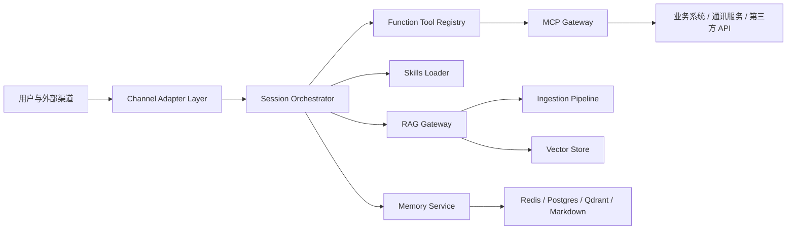

# 总体架构

## 分层结构

## 关键边界

- **Channel Adapter Layer**：只做渠道协议归一化，不直接调用 LLM。
- **Session Orchestrator**：负责会话状态、工具计划、审批中断点、恢复和摘要触发。
- **Function Tool Registry**：负责工具 schema、风险、审批、幂等、审计元数据。
- **MCP Gateway**：负责对外部系统的标准化接入，避免业务 SDK 直接散落在 agent 逻辑中。
- **Skills Loader**：负责根据任务加载领域说明书，而不是把所有领域知识常驻上下文。
- **RAG Gateway**：负责多索引检索、融合、重排和上下文构建。
- **Memory Service**：负责短期状态、滚动摘要、长期事实和身份文件的生命周期。

## 数据流

1. 渠道事件进入 `channels`，转成统一 `NormalizedChannelEvent`。
2. 编排层读取 thread state、相关记忆和必要技能。
3. RAG 层按任务检索文本证据与页面视觉证据。
4. 模型基于上下文选择工具或生成回答。
5. 工具调用经 registry 校验 schema、风险、审批和幂等。
6. 外部系统调用统一经过 MCP Gateway 或 function tool adapter。
7. 结果进入审计日志、会话状态和必要的记忆更新候选。

## 扩展策略

- 模型供应商可替换：OpenAI、Azure、Anthropic、本地 vLLM 或兼容接口。
- 向量库可替换：Qdrant、Weaviate、Milvus、Pinecone。
- 渠道可替换：QQ 官方 Bot、OneBot/NapCat、Webhook、邮件、企业 IM。
- 业务系统可替换：通过 MCP server 或 adapter 接入。
