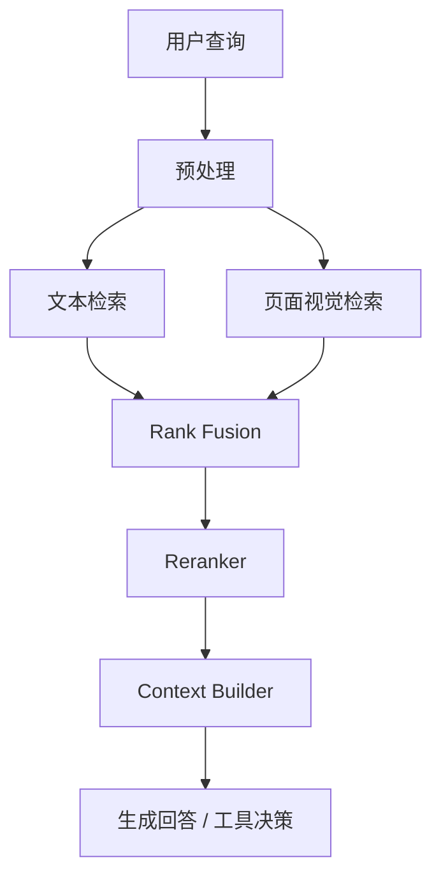

# 多模态 RAG 设计

## 核心原则

不要把所有内容都转成纯文本后做单一向量检索。教育、科研、图表密集 PDF、公式、截图和复杂排版需要文本索引与页面视觉索引并行。

## 索引设计

| 索引 | 内容 | 推荐模型 | 用途 |
|---|---|---|---|
| 文本索引 | 段落、标题、代码、OCR 文本、结构化字段 | BGE-M3 | 语义检索、关键词/稀疏检索、引用片段 |
| 页面视觉索引 | PDF 页面图像、幻灯片、截图 | ColPali / ColQwen | 图表、公式、布局、表格召回 |
| 对象级索引 | 图片区域、表格、视频关键帧 | 可选 VLM/检测模型 | 精细定位和复杂多媒体问答 |

## 检索流程

## 评估指标

- 检索：hit-rate、MRR、recall@k、precision@k、nDCG。
- 回答：faithfulness、answer relevance、citation coverage、hallucination rate。
- 摘要压缩：compression ratio、coverage、contradiction rate。
- 生产：p50/p95 延迟、错误率、索引吞吐、检索成本。

## 数据治理

- 原始文件放对象存储，索引只保存必要片段和元数据。
- 文档、页面、chunk、证据必须有稳定 ID。
- 多租户数据必须使用 tenant/project/course 过滤。
- PII 与敏感材料在摄取时打标，输出前做权限校验。
